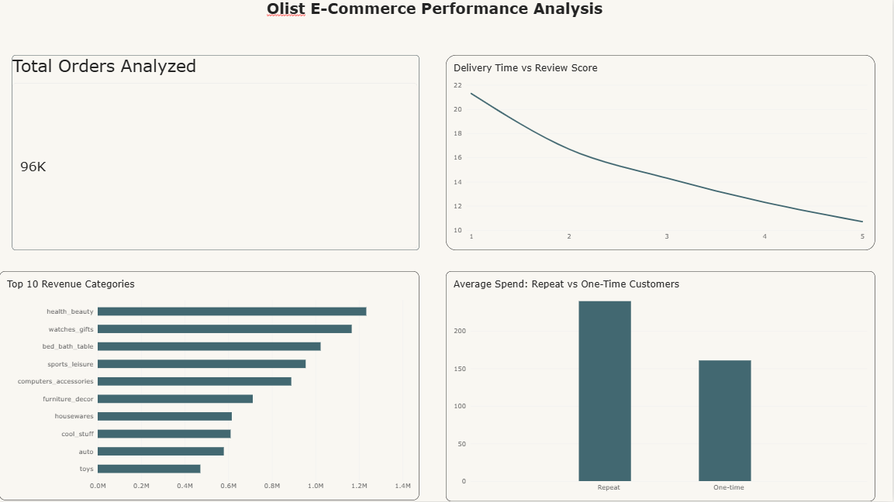

# Olist E-Commerce Performance Analysis

An analysis of the Olist Brazilian e-commerce dataset to answer three business
questions around customer value, delivery performance, and revenue drivers,
using SQL, Python (pandas), and Power BI.

## Dataset

[Olist Brazilian E-Commerce dataset](https://www.kaggle.com/datasets/olistbr/brazilian-ecommerce)
(Kaggle) — ~100k orders across customers, orders, order items, payments,
reviews, products, and sellers tables.

## Tools Used

- **Python (pandas)** — data loading and manipulation
- **SQL (SQLite)** — querying and aggregation
- **Power BI** — dashboard and visualization

## Business Questions & Key Findings

### 1. Are repeat customers more valuable than one-time buyers?
Only about 5.9% of customers are repeat buyers, but they spend **$239.46**
on average per customer versus **$160.58** for one-time buyers — roughly
49% more. This suggests the business is heavily dependent on one-time
purchases, and even a modest increase in repeat-purchase rate could
meaningfully grow revenue, making retention efforts worth prioritizing
alongside acquisition.

### 2. Does delivery time affect customer satisfaction?
There's a clear inverse relationship between delivery time and review
score: orders rated 5 stars took an average of **10.7 days** to deliver,
while 1-star orders took nearly twice as long at **21.3 days**. Delivery
speed appears to be one of the strongest drivers of satisfaction in this
dataset, suggesting that investment in faster/more reliable shipping could
directly improve reviews and retention.

### 3. Which product categories generate the most revenue?
**Health & beauty** is the top revenue category (**$1.23M**), narrowly
ahead of **watches/gifts** (**$1.17M**) despite watches/gifts having far
fewer orders (5,495 vs. 8,647) — implying a notably higher average order
value in that category. Bed/bath/table has the highest order count (9,272)
but lower revenue, suggesting a lower-priced, higher-volume category. This
mix suggests different strategies: volume-driven promotions for
high-volume categories, and leaning into premium positioning for
high-AOV ones.

## Data Cleaning Notes

- Filtered to orders with `order_status = 'delivered'` to exclude
  canceled/unavailable orders from revenue and delivery analysis
- Excluded orders with a missing delivery date from delivery-time analysis
- Used `customer_unique_id` (not `customer_id`, which is per-order in this
  dataset) to correctly identify repeat customers

## Dashboard



## Project Structure

```
├── 01_data_ingestion.ipynb      # Loads CSVs into a SQLite database
├── 03_business_analysis.ipynb   # SQL queries answering the 3 business questions
├── dashboard.png                # Power BI dashboard screenshot
├── q1_repeat_customers.csv
├── q2_delivery_vs_review.csv
├── q3_top_categories.csv
└── README.md
```

## How to Run

1. Download the dataset from Kaggle and place the CSVs in a `data/` folder
2. Run `01_data_ingestion.ipynb` to build the SQLite database
3. Run `03_business_analysis.ipynb` to reproduce the queries and results
